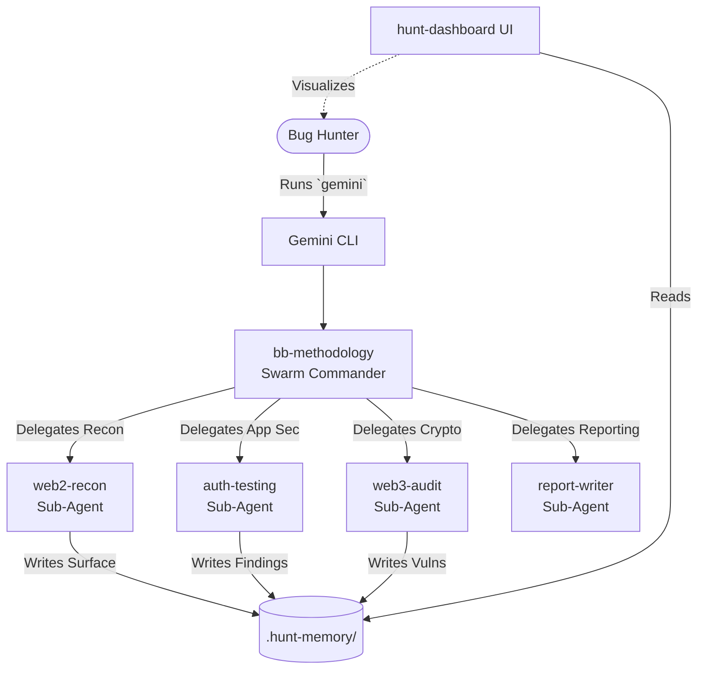

<div align="center">
  <h1>Gemini Bug Bounty Swarm</h1>
  <p><b>An autonomous bug bounty hunting, smart contract auditing, and attack surface discovery tool powered by the official Google Gemini CLI.</b></p>
</div>

<br>

Inspired by `claude-bug-bounty`, this project brings the same modular architecture to the Gemini ecosystem. It leverages Gemini's massive **1M-2M token context window**, native shell integration, and **Multi-Agent Skill Swarm** capabilities to find high-severity bugs autonomously.

<br>

---

<br>

## Architecture & Swarm Logic

Unlike basic CLI wrappers, this tool uses Gemini's native `Agent Skills` feature. The **Swarm Commander** orchestrates the hunt, delegating specific tasks to specialized sub-agents.

All agents write to a shared persistent memory (`.hunt-memory/`), allowing the swarm to pick up where it left off across days or weeks of hunting.



<br>

---

<br>

## The Swarm Agents

| Agent | What It Does |
|:---|:---|
| **bb-methodology** | **The Commander.** Orchestrates the hunt, enforces the 5-phase methodology, and activates other skills dynamically. |
| **web2-recon** | Maps the attack surface. Runs `subfinder`, `httpx`, and `nuclei` via the shell. |
| **auth-testing** | Hunts for IDOR, Business Logic Flaws, and Privilege Escalation using provided session cookies. |
| **web3-audit** | Analyzes Solidity contracts for 10 common DeFi/Crypto vulnerabilities. |
| **report-writer** | Converts raw swarm findings into professional, impact-focused HackerOne/Bugcrowd reports. |

<br>

---

<br>

## What It Can Find

<details>
<summary><b>Web2 Vulnerabilities</b> — click to expand</summary>
<br>

| Vulnerability | What It Means |
|:---|:---|
| **IDOR** | Accessing another user's data by changing a number in the URL |
| **Auth Bypass** | Getting into accounts or admin panels without permission |
| **SSRF** | Making the server fetch internal resources it shouldn't |
| **Business Logic** | Exploiting flaws in how the app is supposed to work |
| **SQL Injection** | Manipulating the database through user inputs |
| **API Misconfig** | Mass assignment, JWT attacks, broken CORS |

</details>

<details>
<summary><b>Web3 / Smart Contract Vulnerabilities</b> — click to expand</summary>
<br>

| Vulnerability | What It Means |
|:---|:---|
| **Accounting Desync** | Contract's math gets out of sync with reality |
| **Access Control** | Functions that should be admin-only aren't |
| **Oracle Manipulation** | Manipulating price feeds to exploit DeFi protocols |
| **ERC4626 Attacks** | Vault share inflation attacks |
| **Reentrancy** | Calling back into a contract before it finishes |

</details>

<br>

---

<br>

## Installation

### 1. Install Gemini CLI
You need Node.js installed on your system.
```bash
npm install -g @google/gemini-cli@latest
gemini --version
```
Authenticate via Google or API Key (see [Gemini CLI Auth](https://github.com/google-gemini/gemini-cli)).

### 2. Install Security Tools
The agents need underlying shell tools to execute attacks.
```bash
git clone https://github.com/YOUR_ORG/gemini-bug-bounty.git
cd gemini-bug-bounty
chmod +x install_tools.sh
./install_tools.sh
```

### 3. Link Agent Skills
This script links the skills into your global Gemini configuration.
```bash
chmod +x install.sh
./install.sh
```

<br>

---

<br>

## Usage

### 1. Start a Hunt
Create a directory for your target and simply start Gemini:

```bash
mkdir target.com && cd target.com
gemini
```

Inside the interactive prompt, tell the Commander to begin:
> "Activate the bb-methodology skill and let's map the attack surface for target.com"

The Commander will seamlessly activate the `web2-recon` agent, run shell tools, save the output to memory, and report back.

### 2. Check the UI Dashboard
Open a second terminal in the same directory to get a beautiful bird's-eye view of your current hunt:
```bash
hunt-dashboard
```

### 3. Advanced Authenticated Testing
If you find an API and want to test for IDORs, give the Commander your session token:
> "Activate auth-testing. Here is my session cookie: `session=xyz`. Test the `/api/v1/users` endpoint for IDORs."

If the JSON response is massive, the swarm automatically utilizes the `browser-helper` python script to cleanly format and truncate the response, ensuring the 2M token context window isn't filled with junk HTML.

<br>

---

<br>

## Memory Management

Gemini Bug Bounty relies on **Persistent File Memory**.
Whenever an agent finds a subdomain, an open port, or a vulnerability, it appends it to markdown files in the `.hunt-memory/` directory.

If you close your laptop and resume the hunt tomorrow, simply type:
> "Read the .hunt-memory logs and tell me where we left off."

Gemini's massive context window will instantly ingest your entire hunt history and resume perfectly.
